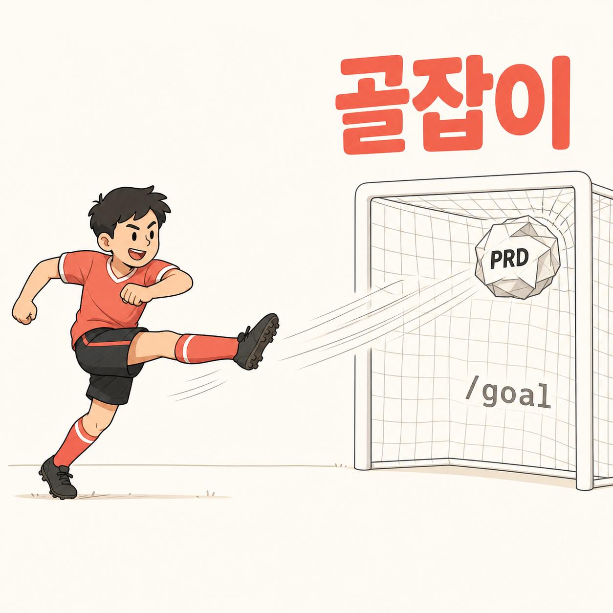

[English](README.md) | [한국어](README.ko.md) | [中文](README.zh.md) | [日本語](README.ja.md) | Español

# goaljaby (골잡이)

<p align="center">
  
</p>

> **Puente PRD→/goal para Claude Code — documentos de revisión en coreano y, tras tu aprobación, el goal arranca de inmediato.**

goaljaby toma una carpeta de PRD (manual o generada por `/show-me-the-prd`) y produce automáticamente cinco documentos de revisión en coreano que envuelven un ciclo de verificación/recuperación — VALIDATION, RECOVERY, PLAN, PROGRESS y el cuerpo del comando `/goal`. El resumen de revisión en coreano se muestra directamente en el chat (sin archivos extra), y se antepone un resumen de 4 líneas a PROGRESS.md para el traspaso. Lees en coreano, apruebas una vez, y el goal comienza en el siguiente turno — el asistente emite la línea `/goal` por ti.

[Inicio rápido](#inicio-rápido) • [¿Por qué goaljaby?](#por-qué-goaljaby) • [Cómo funciona](#cómo-funciona) • [Archivos generados](#archivos-generados) • [Tipos de tarea](#tipos-de-tarea) • [Comandos](#comandos) • [Requisitos](#requisitos)

---

## Inicio rápido

### 1. Añade el marketplace

```
/plugin marketplace add https://github.com/fivetaku/gptaku_plugins.git
```

### 2. Instala

```
/plugin install goaljaby
```

### 3. Reinicia Claude Code

### 4. Ejecuta

Con un directorio de PRD existente — **se recomienda ruta absoluta**:

```
/goaljaby /Users/<username>/my-project/PRD/
```

Sin PRD — goaljaby ofrece delegar en `/show-me-the-prd`:

```
/goaljaby
```

O simplemente dilo con naturalidad:

- "골잡이 호출"
- "골 셋업 만들어줘"
- "PRD에서 골 만들어줘"
- "set up goal from PRD"

---

## ¿Por qué goaljaby?

- **Un PRD por sí solo no basta** — Un PRD dice *qué* construir. `/goal` exige además *cómo demostrar que está terminado* y *cómo recuperarse cuando algo sale mal*. Si falta cualquiera de los dos, el goal se queda en "parece plausible" o se desvía del alcance.
- **Revisión en coreano, no plantillas en inglés** — Los documentos generados son coreano-primero, para que el usuario realmente los lea y revise antes de aprobar. Encabezados como 필수 검증, 완료 기준 매핑, 완료로 보지 않는 조건 — no sus equivalentes en inglés.
- **El resumen de revisión vive en el chat** — Sin archivo brief adicional. El Step 8 muestra un resumen de revisión en coreano directamente en el chat y antepone un resumen de 4 líneas a PROGRESS.md para que el traspaso siga funcionando.
- **Apruebas una vez y el trabajo empieza** — Tras tu aprobación, el asistente emite `/goal {cuerpo}` en la última línea de su respuesta y la sesión inicia el goal en el siguiente turno. Lees el resumen en coreano, apruebas, y el trabajo comienza.
- **La compactación a 4.000 caracteres se impone, no se avisa** — El `/goal` de Claude Code tiene un techo de 4.000 caracteres. goaljaby aplica una compactación en 5 etapas y, si aun así no cabe, aborta limpiamente con un informe de desbordamiento estructural. Sin truncados silenciosos.
- **Las PROTECTED_CLAUSES son irrecortables** — Condición de parada, bloqueo de alcance, regla de 3 intentos, directiva de lectura de documentos y actualización de PROGRESS se verifican con regex OR coreano+inglés tras la compactación. Si falta alguna cláusula, el resultado se descarta.
- **Puerta de aprobación humana obligatoria** — El AskUserQuestion del Step 9 no se puede saltar. El goal solo arranca tras tu aprobación explícita.

---

## Cómo funciona

```
Directorio de PRD
     │
     ▼
[Step 0-1] Comprobación previa + análisis
     │   ¿Sin PRD? → delega en /show-me-the-prd
     │   Extrae acceptance / non-goals / tipo de tarea
     ▼
[Step 2-4] Entrevista (1-2 rondas)
     │   task_type, métodos de validación, rigor, hitos
     ▼
[Step 5] Rellena los 5 documentos en coreano
     │   VALIDATION / RECOVERY / PLAN / PROGRESS / goal-command
     ▼
[Step 6] Compacta goal-command.md a ≤4.000 caracteres
     │   normalizar → externalizar → abreviar → resumir → recortar
     ▼
[Step 7] Autoverificación determinista
     │   grep -P contra las 5 PROTECTED_CLAUSES OR coreano+inglés
     │   + recuento de caracteres + detección de encabezados en inglés
     │   Si falla → informe de desbordamiento estructural + DESCARTE
     ▼
[Step 8] Muestra el resumen de revisión en coreano en el chat
     │   + antepone un resumen de 4 líneas a PROGRESS.md (traspaso)
     ▼
[Step 9] AskUserQuestion — aprobar / revisar / más tarde / cancelar
     ▼
[Step 10] Tras la aprobación:
          • Registra la hora de inicio en PROGRESS.md
          • Emite `/goal {cuerpo}` como última línea de la respuesta
          • La sesión inicia el goal en el siguiente turno
```

---

## Archivos generados

```
[PRD directory]/
├── VALIDATION.md      ← 필수 검증 / 완료 기준 매핑 / 완료로 보지 않는 조건
├── RECOVERY.md        ← 기본 원칙 / 실패 루프 / 재시도 한계 / scope 잠금
├── PLAN.md            ← 목표 / 마일스톤(≤5) / 최종 완료 기준
├── PROGRESS.md        ← 빈 초기 템플릿 + Step 8 4-line summary prepended
└── goal-command.md    ← /goal 본문 (한국어, ≤4,000 chars)
```

Los cinco son coreano-primero. El resumen de revisión del Step 8 se muestra solo en el chat (sin archivo extra). Los nombres de archivo, los identificadores de comandos y los comandos de shell se mantienen tal cual.

---

## Tipos de tarea

| Tipo de tarea | Énfasis de VALIDATION | Énfasis de RECOVERY | Plantilla /goal |
|-----------|---------------------|-------------------|----------------|
| 기능 구현 (funcionalidad) | Tests unitarios + de integración | Bloqueo de alcance | F-2 |
| 버그 수정 (corrección de bugs) | Reproducción original + regresión | Sin tocar módulos no relacionados | F-1 |
| UI 구현 (implementación de UI) | Capturas + comprobaciones de viewport | Protección de design tokens | F-3 |
| 문서 집필 (redacción de docs) | Revisión sección por sección | Secciones congeladas tras aprobarse | F-4 |
| 마이그레이션 (migración) | Comprobación de paridad + rollback | Inmutabilidad de la API pública | F-5 |
| eval 개선 (mejora de evals) | Puntuación frente al baseline | Un cambio de prompt a la vez | F-6 |

El tipo de tarea se estima automáticamente a partir del contenido del PRD (coincidencia ponderada de palabras clave en coreano e inglés) y el usuario lo confirma en el Step 3.

---

## Promesas clave

- **Los documentos generados son coreano-primero** — El Step 7 detecta encabezados en inglés que se hayan colado. Si aparecen, el resultado se descarta. Nada de salidas a medio traducir.
- **El resumen de revisión se queda en el chat** — Sin archivo brief separado. PROGRESS.md recibe un resumen de 4 líneas en la parte superior para el traspaso.
- **`goal-command.md` siempre tiene ≤4.000 caracteres** — Si la compactación no lo consigue, el archivo no se guarda; se imprime un informe de desbordamiento estructural en su lugar.
- **Las PROTECTED_CLAUSES son inviolables** — Condición de parada, bloqueo de alcance, regla de 3 intentos, referencias a documentos y actualización de PROGRESS quedan protegidas por regex OR coreano+inglés.
- **La puerta de aprobación del Step 9 no se puede saltar** — El Step 10 solo se dispara tras una aprobación humana explícita.
- **Autodemostrativo** — construir esta misma skill es un objetivo válido para goaljaby.

---

## Comandos

| Comando | Descripción |
|---------|-------------|
| `/goaljaby [directorio de PRD]` | Empieza con un directorio de PRD existente |
| `/goaljaby` | Interactivo — ofrece delegar en `/show-me-the-prd` si no hay PRD |

### Disparadores en lenguaje natural

- "골잡이 호출"
- "골 셋업 만들어줘"
- "PRD에서 골 만들어줘"
- "VALIDATION RECOVERY 만들어줘"
- "set up goal from PRD"
- "make goal scaffolding"
- "prep goal docs"

---

## Requisitos

- [Claude Code](https://docs.anthropic.com/claude-code) CLI **v2.1.139+**
- Hooks activos (`disableAllHooks` / `allowManagedHooksOnly` sin establecer)

### Plugins opcionales (recomendados)

| Plugin | Qué aporta |
|--------|--------------|
| `show-me-the-prd` | goaljaby delega automáticamente en el Step 0 cuando no existe PRD |

El plugin funciona sin él — el Step 0 recurre a una ruta de PRD manual o a un goal ligero de una sola línea.

---

## Fuente

Claude Code `/goal`: https://code.claude.com/docs/en/goal

---

## Licencia

MIT

---

<div align="center">

**Lee en coreano. Aprueba. El goal comienza.**

</div>
