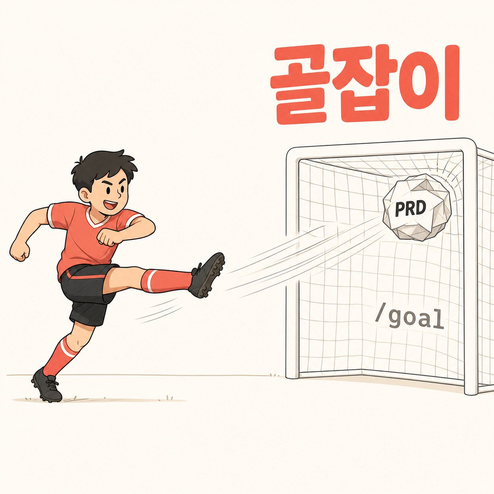

[English](README.md) | [한국어](README.ko.md) | 中文 | [日本語](README.ja.md) | [Español](README.es.md)

# goaljaby (골잡이)

<p align="center">
  
</p>

> **Claude Code 的 PRD→/goal 桥接器 — 评审文档用你的语言生成，你批准后 goal 任务随即启动。**

goaljaby 接收一个 PRD 文件夹（手动创建或来自 `/show-me-the-prd`），**以你的语言**自动生成包裹"验证/恢复"闭环的五份评审文档（语言从你的请求中自动识别；韩语和英语为一等支持，标题经确定性验证，其他语言尽力而为）— VALIDATION、RECOVERY、PLAN、PROGRESS，以及 `/goal` 命令正文。评审摘要直接显示在对话中（不产生额外文件），同时在 PROGRESS.md 顶部前置一份 4 行摘要用于交接。你用自己的语言阅读、批准一次，goal 就在下一轮启动 — `/goal` 那一行由助手替你发出。

[快速开始](#快速开始) • [为什么是 goaljaby](#为什么是-goaljaby) • [工作原理](#工作原理) • [生成文件](#生成文件) • [任务类型](#任务类型) • [命令](#命令) • [环境要求](#环境要求)

---

## 快速开始

### 1. 添加市场

```
/plugin marketplace add https://github.com/fivetaku/gptaku_plugins.git
```

### 2. 安装

```
/plugin install goaljaby
```

### 3. 重启 Claude Code

### 4. 运行

已有 PRD 目录时 — **建议使用绝对路径**：

```
/goaljaby /Users/<username>/my-project/PRD/
```

没有 PRD 时 — goaljaby 会提议委托给 `/show-me-the-prd`：

```
/goaljaby
```

也可以直接用自然语言：

- "골잡이 호출"
- "골 셋업 만들어줘"
- "PRD에서 골 만들어줘"
- "set up goal from PRD"

---

## 为什么是 goaljaby

- **只有 PRD 是不够的** — PRD 定义的是*要做什么*。`/goal` 还需要*如何证明已完成*以及*出了问题如何恢复*。缺了任何一项，goal 要么停在"看起来差不多"，要么偏离范围。
- **用你的语言评审，而非外语样板** — 输出语言跟随你的请求（`output_lang`），从不硬编码默认值：韩语用户看到的是 필수 검증 / 완료 기준 매핑，英语用户看到的是 Required Checks / Acceptance Criteria Mapping。读不懂的评审会让批准关卡失去意义，所以文档用你真正会读的语言生成。
- **评审摘要就在对话里** — 不产生额外的 brief 文件。Step 8 直接在对话中显示评审摘要，并在 PROGRESS.md 顶部前置 4 行摘要，交接依然可用。
- **批准一次，工作即开始** — 你批准后，助手在回复的最后一行发出 `/goal {正文}`，会话在下一轮启动该 goal。读完评审摘要、点下批准，工作就开始了。
- **4,000 字符压缩是强制而非提醒** — Claude Code 的 `/goal` 有 4,000 字符上限。goaljaby 会执行 5 级压缩；如果仍放不下，就输出结构性溢出报告并干净地中止。不存在静默截断。
- **PROTECTED_CLAUSES 不可删减** — 停止条件、范围锁定、3 次尝试规则、文档阅读指令、PROGRESS 更新，这五项在压缩后用韩语+英语 OR 正则验证（标题做 ko↔en 交叉检查；其他语言回退为检查章节键是否存在）。压缩后缺任何一条，输出即作废。
- **强制的人工批准关卡** — Step 9 的 AskUserQuestion 无法绕过。只有你明确批准后，goal 才会启动。

---

## 工作原理

```
PRD 目录
     │
     ▼
[Step 0-1] 预检 + 分析
     │   没有 PRD？ → 委托给 /show-me-the-prd
     │   提取 acceptance / non-goals / 任务类型
     ▼
[Step 2-4] 访谈（1-2 轮）
     │   task_type、验证方式、严格度、里程碑
     ▼
[Step 5] 以 output_lang 槽位填充 5 份文档（若存在设计参考 / kkirikkiri 关卡则一并继承）
     │   VALIDATION / RECOVERY / PLAN / PROGRESS / goal-command
     ▼
[Step 6] 将 goal-command.md 自动压缩至 ≤4,000 字符
     │   规范化 → 外部化 → 缩写 → 概要化 → 精简
     ▼
[Step 7] 确定性的自我验证
     │   用 grep -P 匹配 5 条韩语+英语 OR 的 PROTECTED_CLAUSES
     │   + 字符数检查 + 英文标题残留检查
     │   失败时 → 结构性溢出报告 + 作废
     ▼
[Step 8] 在对话中显示评审摘要（output_lang）
     │   + 在 PROGRESS.md 顶部前置 4 行摘要（用于交接）
     ▼
[Step 9] AskUserQuestion — 批准 / 修改 / 稍后 / 取消
     ▼
[Step 10] 批准后：
          • 在 PROGRESS.md 中记录开始时间
          • 在回复最后一行发出 `/goal {正文}`
          • 会话在下一轮启动 goal
```

---

## 生成文件

```
[PRD directory]/
├── VALIDATION.md      ← 필수 검증 / 완료 기준 매핑 / 완료로 보지 않는 조건
├── RECOVERY.md        ← 기본 원칙 / 실패 루프 / 재시도 한계 / scope 잠금
├── PLAN.md            ← 목표 / 마일스톤(≤5) / 최종 완료 기준
├── PROGRESS.md        ← 빈 초기 템플릿 + Step 8 4-line summary prepended
└── goal-command.md    ← /goal 본문 (output_lang, ≤4,000 chars)
```

五份文档全部以 `output_lang` 生成（即你的请求语言；ko/en 标题经确定性验证）。Step 8 的评审摘要只显示在对话中（不产生额外文件）。

**继承的上下文（v0.6.0+ / v0.6.2+）**：如果 PRD 文件夹带有来自 `/show-me-the-prd` v0.10+ 的 `references/` + `sources.json`，风格关键词和保留的图片会被继承到 PLAN.md/VALIDATION.md 中（附带版权保护）。如果安装了 kkirikkiri v0.23+，RECOVERY.md 还会加入多智能体关卡规则（Workflow 之前先跑 wf-lint、给 teammate 加边界块、评审者只读）— 未安装 kkirikkiri 时静默跳过。文件名、命令标识符和 shell 命令保持原样。

---

## 任务类型

| 任务类型 | VALIDATION 侧重 | RECOVERY 侧重 | /goal 模板 |
|-----------|---------------------|-------------------|----------------|
| 기능 구현（功能实现） | 单元 + 集成测试 | 范围锁定 | F-2 |
| 버그 수정（缺陷修复） | 原始复现 + 回归 | 禁止改动无关模块 | F-1 |
| UI 구현（UI 实现） | 截图 + 视口检查 | 设计令牌保护 | F-3 |
| 문서 집필（文档撰写） | 逐节评审 | 已批准章节冻结 | F-4 |
| 마이그레이션（迁移） | 一致性检查 + 回滚 | public API 不可变 | F-5 |
| eval 개선（eval 改进） | 对比基线的得分 | 一次只改一个提示词 | F-6 |

任务类型根据 PRD 内容自动推断（韩语+英语关键词加权匹配），并在 Step 3 由用户最终确认。

---

## 核心承诺

- **生成文档为单一语言** — Step 7 对标题做 ko↔en 交叉检查：韩语运行中残留英文标题，或英语运行中残留韩语标题，结果都会作废。不会输出半翻译的文档。
- **评审摘要只在对话中** — 不产生单独的 brief 文件。PROGRESS.md 顶部保留 4 行摘要用于交接。
- **`goal-command.md` 始终 ≤4,000 字符** — 压缩仍放不下时不保存文件，转而打印结构性溢出报告。
- **PROTECTED_CLAUSES 不可侵犯** — 停止条件、范围锁定、3 次尝试规则、文档引用、PROGRESS 更新由韩语+英语 OR 正则保护。
- **Step 9 批准关卡无法绕过** — Step 10 只在人工明确批准后触发。
- **自我示范** — 构建这个技能本身也是一个合规的 goaljaby 目标。

---

## 命令

| 命令 | 说明 |
|---------|-------------|
| `/goaljaby [PRD 目录]` | 用已有的 PRD 目录启动 |
| `/goaljaby` | 交互式 — 没有 PRD 时提议委托给 `/show-me-the-prd` |

### 自然语言触发

- "골잡이 호출"
- "골 셋업 만들어줘"
- "PRD에서 골 만들어줘"
- "VALIDATION RECOVERY 만들어줘"
- "set up goal from PRD"
- "make goal scaffolding"
- "prep goal docs"

---

## 环境要求

- [Claude Code](https://docs.anthropic.com/claude-code) CLI **v2.1.139+**
- hooks 已启用（未设置 `disableAllHooks` / `allowManagedHooksOnly`）

### 可选插件（推荐）

| 插件 | 带来的能力 |
|--------|--------------|
| `show-me-the-prd` | 没有 PRD 时，goaljaby 在 Step 0 自动委托 |

不装也能用 — Step 0 会回退到手动输入 PRD 路径，或一行式的轻量 goal。

---

## 来源

Claude Code `/goal`: https://code.claude.com/docs/en/goal

---

## 许可证

MIT

---

<div align="center">

**用你的语言阅读。批准。goal 启动。**

</div>
